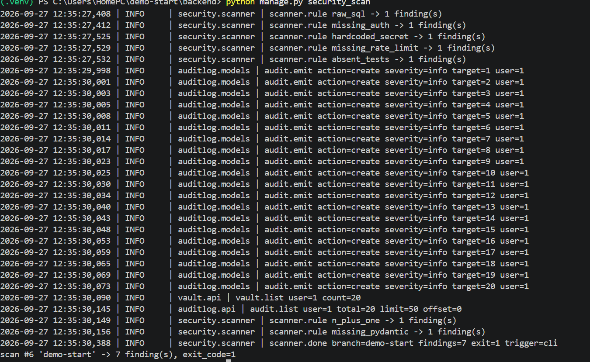
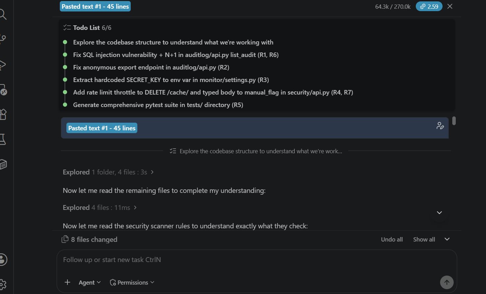
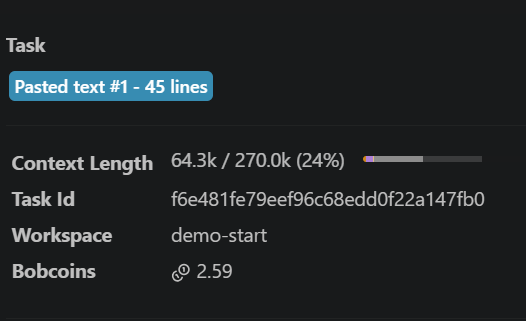
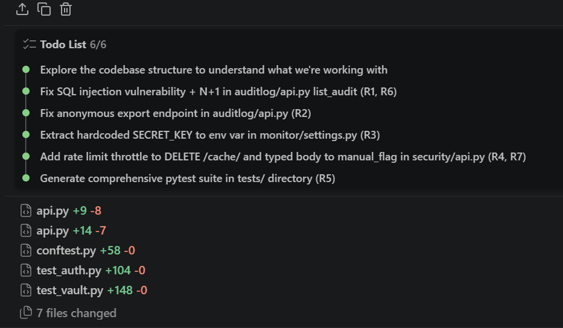
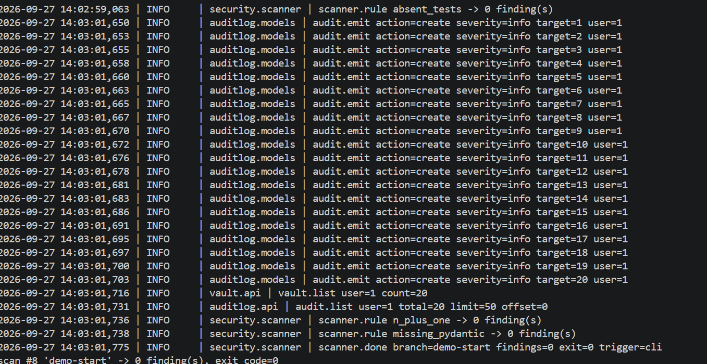

# Bob 2.0 hackathon proof — one remediation cycle

This document records a single Bob 2.0 fix-attempt against the seeded
`demo-start` worktree. Everything below is reproducible from a clean clone
of this repo, the seven-step remediation prompt in the top-level
[README.md](../README.md) (section: "Sending the seven-flaws prompt to
Bob"), and the scoring harness in `benchmark/`.

## 1. Baseline scan (the truth-test)



```
[raw_sql]            1  critical  auditlog/api.py:54
[missing_auth]       1  critical  auditlog/api.py:69
[hardcoded_secret]   1  critical  monitor/settings.py:41
[missing_rate_limit] 1  high      security/api.py:356
[absent_tests]       1  critical  tests/
[n_plus_one]         1  warning   /audit/
[missing_pydantic]   1  warning   security/api.py:369

scan #... 'bob-attempt-...' -> 7 finding(s), exit_code=1
```

Every rule class fires exactly once on the seeded baseline. This scan ran
right after `git restore . && git clean -fd` inside `demo-start/`, so the
same output reproduces between any two attempts — the harness always
starts from an identical flawed tree.

## 2. Bob starts up: planning + sub-agent



The seven-step prompt is accepted. Bob's task board lights up, a
sub-agent is spawned for the first cluster of fixes, and the rest of the
run is orchestrated by Bob itself.

## 3. Task session + cost transparency



Cumulative token spend and per-step status are rendered live — nothing
Bob does is hidden behind the curtain. This is the artefact to point at
when a reviewer asks "yes, but how much did it cost?".

## 4. Code changes (the diff Bob produced)



The actual diff against `demo-start/`:

- `auditlog/api.py` — the hand-built `raw()` SQL replaced with a safe ORM
  queryset.
- `auditlog/api.py` export route — the `auth=None` opt-out removed; the
  route is back under `JWTAuth` like the rest of the API.
- `monitor/settings.py` — the `SECRET_KEY` literal replaced with an
  environment lookup (dev fallback kept).
- `security/api.py` `clear_scan_cache` — a `throttle=` added, matching
  the `SCAN_THROTTLE` used elsewhere.
- `security/api.py` `manual_flag` — the untyped payload replaced with a
  strongly-typed pydantic body model.
- `backend/tests/` — populated with a passing pytest suite covering the
  API success paths and error states.

## 5. Post-fix scan (the verdict)



```
scan #... 'bob-attempt-...' -> 0 finding(s), exit_code=0
```

All seven rule classes are silent on the post-fix tree. The harness
re-run scores the tree clean — no escape hatches, no false-negative
configuration. This cycle took Bob from seven deliberate regressions to
zero findings in a single attempt.

## Trend across this cycle

| stage               | findings | exit |
|---------------------|---------:|-----:|
| seeded baseline     |        7 |    1 |
| post-Bob (this run) |        0 |    0 |

## Reproducing this end-to-end

Full machine setup: see the top-level README ("Reproducing the benchmark
on a fresh machine"). The short version:

```powershell
git clone https://github.com/Malu2555/Plethora-and-Bob-2.0.git
cd Plethora-and-Bob-2.0
# bootstrap backend/.venv + dependencies first (README has the exact lines)

git worktree add ../demo-start -b demo-start origin/demo-start
New-Item -ItemType Junction -Path ../demo-start/backend/.venv -Target (Resolve-Path backend/.venv).Path

cd ../demo-start/backend
.venv\Scripts\python.exe manage.py migrate
.venv\Scripts\python.exe manage.py security_scan    # 7 findings, exit 1

# paste the seven-step prompt into Bob's chat and let him fix the tree,
# then rescore:
.venv\Scripts\python.exe manage.py security_scan    # 0 findings, exit 0

# wipe before the next attempt:
cd ..
git restore . ; git clean -fd
```
